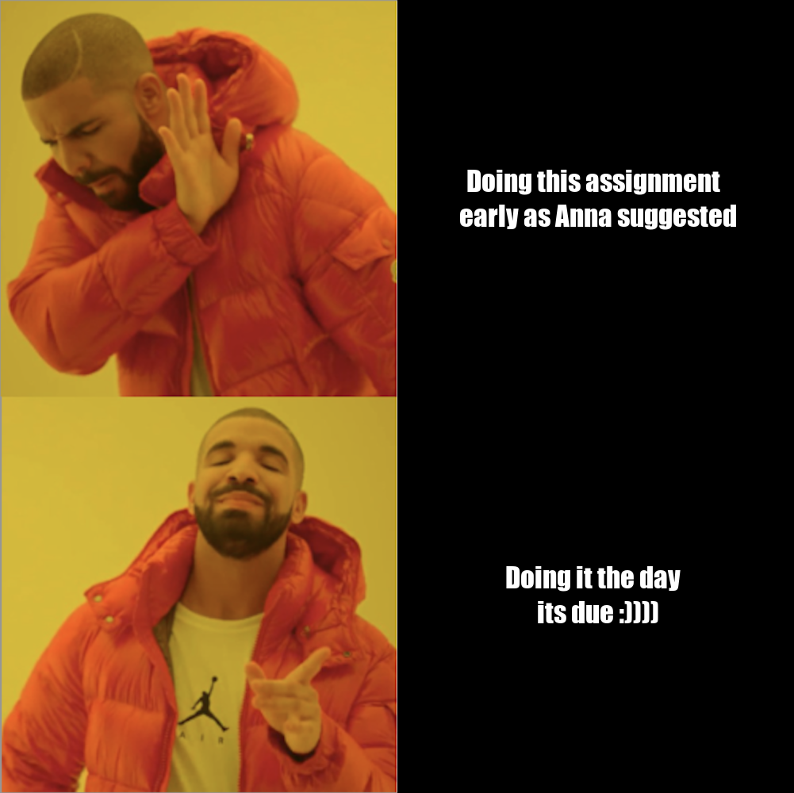

# The Meme



## Artistic Analysis

## THE CODE

```
library(magick)

# Text Component
memeText1 <- image_blank(width = 500,
                      height = 500,
                      color = "#000000") %>%
  image_annotate(text = "Doing this assignment \n early as Anna suggested",
                 color = "#FFFFFF",
                 size = 35,
                 font = "Impact",
                 style = "italic",
                 gravity = "center")
  
memeText2 <- image_blank(width = 500,
                         height = 500,
                         color = "#000000") %>%
  image_annotate(text = "Doing it the day \n its due :))))",
                 color = "#FFFFFF",
                 size = 35,
                 font = "Impact",
                 style = "italic",
                 gravity = "center")

# Image Component
memePicture1 <- image_read(path = "component_images/SadDrake.png") %>%
  image_scale("x500")

memePicture2 <- image_read(path = "component_images/HappyDrake.png") %>%
  image_scale("x500")

topRow <- c(memePicture1, memeText1) %>%
  image_append(stack = FALSE)
bottomRow <- c(memePicture2, memeText2) %>%
  image_append(stack = FALSE)

meme <- c(topRow, bottomRow) %>%
  image_append(stack = TRUE)

#Display Meme
meme

# Export Meme
image_write(meme, "meme.png", comment = "STATS 220 - Liam Barnes (lbar177)")
```
