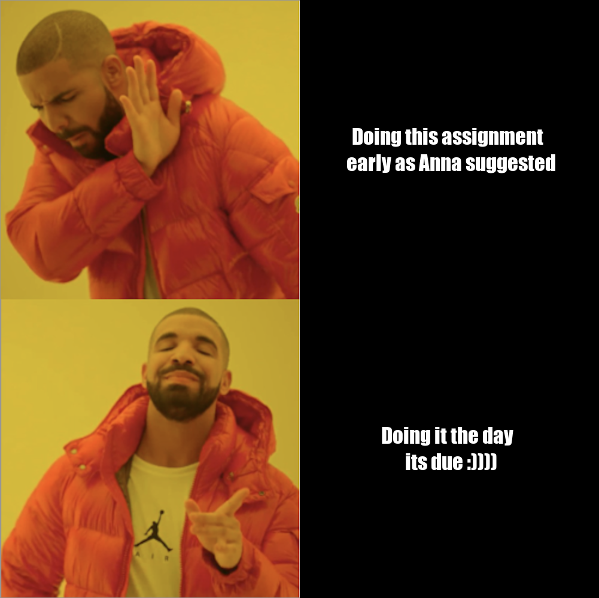
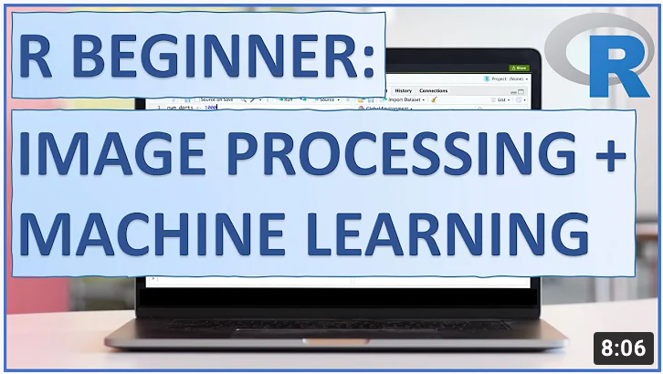

# The Meme



## Purpose
The *purpose* of this, **meme** is as follows:
- Get **100%** on **Assignment 1** of *Stats 220*
- Acknowledge that my procrastination is a problem
- Persaude the markers to give me a good grade with my *extremely funny* meme

The motivation for this meme was that I wanted to illustrate how procrastination was a part of my personality. Moreover I felt that the use of a pre-existing meme format made me seem more familiar with pop-culture which would make me appear more *creative*.

## Methodology 
The development of this meme was as follows:

1. Import the relevant libraries.
2. Create two blank images upon which the text can be displayed
3. Style blank images.
4. Add styled text to both images.
5. Load Drake images.
6. Scale Drake images.
7. Create top and bottom row vectors of images.
8. Combine top and bottom rows.
9. Display and export meme.

***
## The Code
Here is the `code` I used to create this meme:

```
library(magick)

# Text Component
memeText1 <- image_blank(width = 500,
                      height = 500,
                      color = "#000000") %>%
  image_annotate(text = "Doing this assignment \n early as Anna suggested",
                 color = "#FFFFFF",
                 size = 35,
                 font = "Impact",
                 style = "italic",
                 gravity = "center")
  
memeText2 <- image_blank(width = 500,
                         height = 500,
                         color = "#000000") %>%
  image_annotate(text = "Doing it the day \n its due :))))",
                 color = "#FFFFFF",
                 size = 35,
                 font = "Impact",
                 style = "italic",
                 gravity = "center")

# Image Component
memePicture1 <- image_read(path = "component_images/SadDrake.png") %>%
  image_scale("x500")

memePicture2 <- image_read(path = "component_images/HappyDrake.png") %>%
  image_scale("x500")


# Combine Image & Text Components
topRow <- c(memePicture1, memeText1) %>%
  image_append(stack = FALSE)
bottomRow <- c(memePicture2, memeText2) %>%
  image_append(stack = FALSE)

meme <- c(topRow, bottomRow) %>%
  image_append(stack = TRUE)<iframe width="560" height="315" src="https://www.youtube.com/embed/nkX_gQKsFzQ" title="YouTube video player" frameborder="0" allow="accelerometer; autoplay; clipboard-write; encrypted-media; gyroscope; picture-in-picture" allowfullscreen></iframe>

#Display Meme
meme

# Export Meme
image_write(meme, "meme.png", comment = "STATS 220 - Liam Barnes (lbar177)")
```
## Youtube Video
Just for fun, here is a youtube tutorial of programming in R but since I can't actually embed a youtube video in Markdown, its a photo which is a link to a youtube video.

<a href="https://www.youtube.com/embed/nkX_gQKsFzQ" target="_blank"></a>
