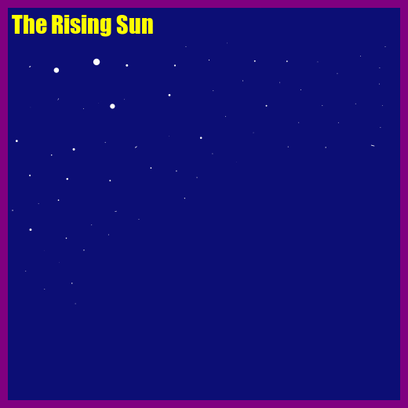

```{r setup, include=FALSE}
knitr::opts_chunk$set(echo = FALSE)
```

```{=html}
<style>
  #github {
    border-style: dashed;
  padding: 5px;
}

  #gifCreationTitle {
  text-shadow: 4px 4px;
}
  #gifCreation {
  text-shadow: 0px 0px;
}

  #gif {
  text-align: center;
  cursor: crosshair;
  background-color: #03d7fc;
}

  #reflection {
  text-align: left;
  cursor: pointer;
}
</style>
```
## Git Hub Repository Information {#github}

Here is the link to my STATS 220 Github Repository: <https://github.com/liam-barnes/STATS220>

The purpose of this repository is to store my work for the Stats 220 course, specifically, at this point in time, its purpose is to store and make accessible all files related to Stats 220 Assignment 1.

## Animated GIF Creation {#gifCreationTitle}

##  {#gifCreation}

The following R code was used to generate my animated GIF.

```{r animatedGifCreation, echo=TRUE}
library(magick)

# Create vector of all relevant image paths
framePath <- paste("component_images/rising_sun/frame_", 1:4, sep = "")

# Create vector of image objects
frames <- image_read(path = framePath) %>%
  image_scale("x500")

# Creative Additions to Frames
frames <- image_border(frames, "purple", "10x10")
frames <- image_annotate(frames, 
                         text = "The Rising Sun",
                         color = "yellow",
                         gravity = "northwest",
                         location = "+15+12",
                         size = 30,
                         font = "impact")

# creating an animation
rising_sun <- image_animate(frames, fps = 1)
image_write(rising_sun, "rising_sun.gif")
```

##  {#gif}



## Learning Reflection {#reflection}

One of the key things that I have learnt when implementing modern data technologies is that while there are implementation methodologies that will work for a particular situation, when I decided that I wanted to make some type of change, it was frustrating and cumbersome, writing code efficient and future thinking is paramount when designing robust systems. You might notice that in designing the GIF I made an attempt to reduce repetition within my code (e.g through the use of the paste function and the way I have named files). Moreover, I have learnt how to use Markdown (which I have seen used on forums before but never really taken the time to understand), which I find is a really enjoyable and even easier than HTML. Additionally, I learnt about some rudimentary concepts in the R language which I hope will serve as a foundation for a sophisticated use of R in statistical analysis. Finally I learnt of the depth of the R language (there are an insane number of libraries for R).

I am looking forward to learning about how we can use data technologies (yet to be known to me) to effectively and efficiently analyse data. But perhaps more interestingly (as I have an interest in experimental economic research) how we can use data technologies to ensure we are retrieving accurate and useful data - after all garbage in garbage out.

## Additional Information
If you are having trouble viewing this page you might try viewing it via this link: <https://rpubs.com/liambarnes/stats220assignment1> However note that this version of the page may not be updated.

If you have any feedback please enter it in this form.
<form>

<label for="email">Feedback Form:</label> <input type="text">

</form>

